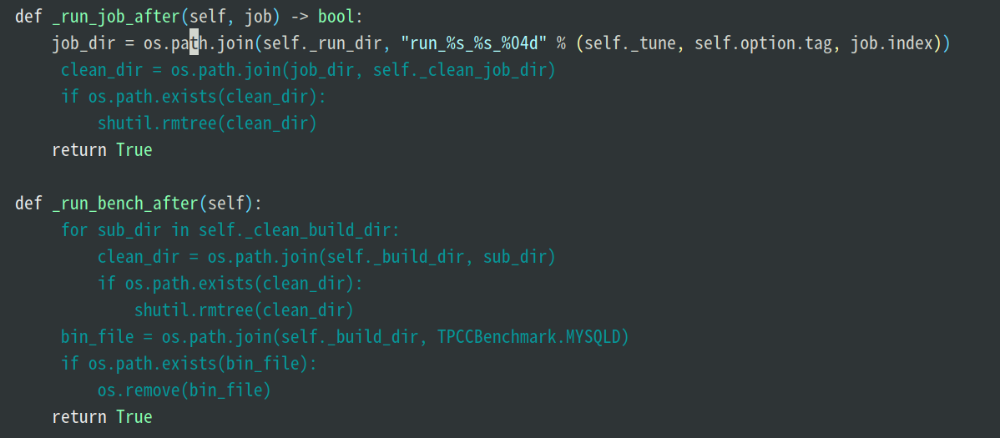
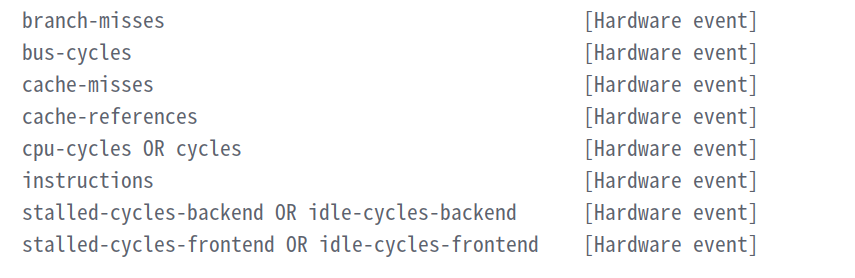
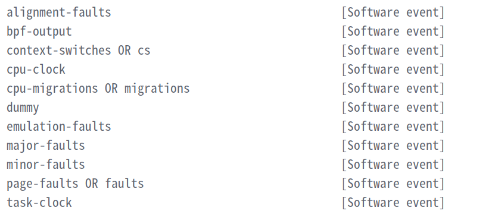
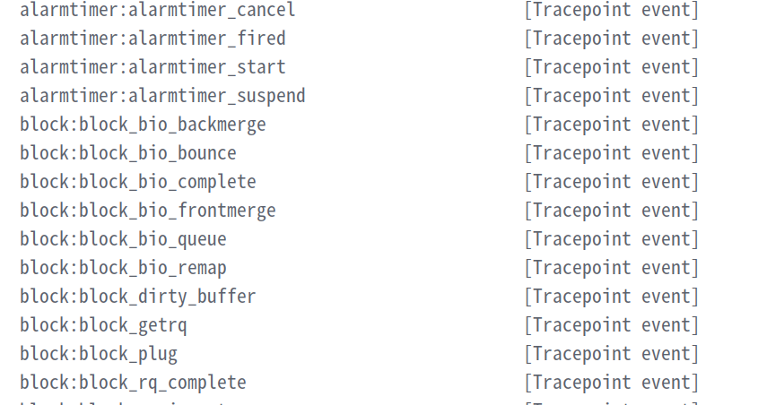
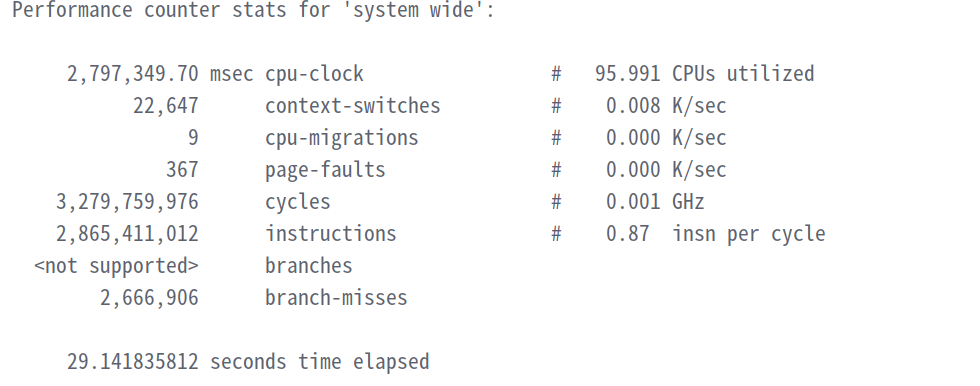
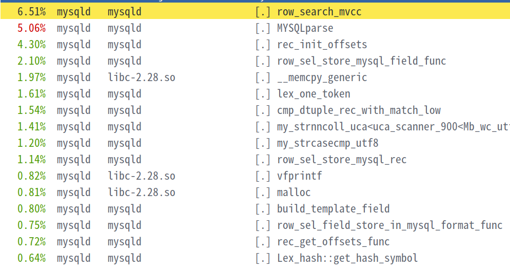

- [**CPUBench 运行**](#cpubench-运行)
- [**CPUBench tpcc/tpch**](#cpubench-tpcctpch)
  - [**cpubench tpcc 测试简介**](#cpubench-tpcc-测试简介)
  - [**tpcc 优化探索**](#tpcc-优化探索)
  - [**小收获**](#小收获)
  - [**前车之鉴**](#前车之鉴)
- [**perf 工具**](#perf-工具)
  - [**perf list**](#perf-list)
  - [**perf top**](#perf-top)
  - [**perf stat**](#perf-stat)
  - [**perf record \& perf report**](#perf-record--perf-report)

# **CPUBench 运行**
1. `tar -zxvf CPUBench-v1.1.0.beta.tar.gz` *将CPUBench源码包解压*
2. `yum install -y perl gcc gcc-c++ gcc-gfortran java numactl` *3C5000准备运行环境*  
  or  
   `apt-get install -y perl gcc g++ gfortran default-jdk numactl` *3A5000准备运行环境*  
3. `cd /path/CPUBench` *进入CPUBench目录*  
   `vim ./config/config-template.ini` *修改配置文件*   

   3-1. 将benchmarks指定为tpcc/tpch 
   3-2 修改compiler for C/C++的CFLAGS及CXXFLAGS参数为`-Ofast -march=loongarch64 -mtune=loongarch64 -flto -mlsx -mlasx`，添加编译优化选项。  
   3-3. 如果对源码文件进行了修改，替换 `action=standard` 为 `action=clean` ,为缩短测试时间，可以将`iterations`修改为1只进行一轮测试。  
   3-4. `./cpubench.sh --skip_verify=1`  *运行CPUBench，如果对源码文件进行了修改，执行本命令后将` action=clean` 替换回 `action=standard` 再执行本命令一次。*
4. 如果需要对编译核运行中的中间文件进行查看，需要将对应benchmark的clean功能禁用，以tpcc测试为例，作如下修改。
   

# **CPUBench tpcc/tpch** 
## **cpubench tpcc 测试简介**
依照TPCC规范将测试分为5项，分别为`NEW ORDER `、`PAYMENT`、`DELIVERY`、`ORDER STATUS`、`STOCK LEVEL`，测试共计2500轮，每轮测试中进行以上事务次数为10,10,1,1,1次，计算运行总时间，用其除x86标准时间即可得到标准得分。
## **tpcc 优化探索**

对NEW ORDER 等事务进行独立计时，同KP进行比对，寻找各项事务差距。
      
|     项目     | 龙芯3C5000L |  鲲鹏920  | 龙芯3A5000 |
| :----------: | :---------: | :-------: | :--------: |
|  new_order   |  124.798 s  | 75.3539 s | 117.532 s  |
|   payment    |  60.4863 s  | 41.9695 s |  54.929 s  |
| order_status |  7.22046 s  | 5.07482 s |  6.5634 s  |
|   delivery   |  15.9465 s  | 9.61009 s | 14.9454 s  |
| stock_level  |  3.25617 s  | 2.07754 s |  2.9546 s  |  

从表中可以看出，<font color=#dd0000>主要差距体现在NEW ORDER 事务中。</font>  
+ 对NEW ORDER与PAYMENT进行换位处理，排除warmup对时间影响
+ 通过注释其他事务对各事务进行单独计时，考察及时的有效性。  
<font color=#dd0000>经过以上操作，认为上述结论有效</font>
  

对tpcc测试生成的mysqld可执行程序进行反汇编处理，查看其中的dbar指令生成数量。  
`objdump -d mysqld > mysql.S`  
`grep dbar mysql.S |wl -c`   
经过比对，静态代码中KP生成内存屏障988个，龙芯生成内存屏障15347个。


利用perf工具对tpcc测试进行热方法分析（perf工具的使用见下文）。  
分析热点落在memcpy上，虽然未能对memcpy进行替换，但了解到在makefile中编译`.S`的汇编源码文件需要添加`enable_language(ASM)`标识。
在生成的汇编代码来看，由于KP融合指令等的关系，龙芯生成的汇编指令数较KP的更多。

## **小收获**
高精度时间计时
```c++
#include <ctime>
#include <ratio>
#include <chrono>
auto t_start = std::chrono::high_resolution_clock::now();
auto t_end = std::chrono::high_resolution_clock::now();
std::chrono::duration<double> diff = t_end - t_start;
std::out<<diff.count()<<endl;
```
## **前车之鉴**
c++ 变量的声明不应当放在循环/分支跳转语句内部，会容易出现已经定义声明的变量被二次初始化类型报错的问题。  
如：
```c++
 for(auto transaction:run_list) {
            switch (transaction) {
                case NEW_ORDER:
                    auto t_start =std::chrono::high_resolution_clock::now();
                    generate_neworder_param();
                    execute_neworder_transaction();
                     break;
                     ...
                     ...
            }
 }
```
在执行时会因为`t_start`的类型初始化而报错，应当将`t_start`提出`switch-case`语句提前声明。

# **perf 工具**
（1）Perf是内置于Linux内核源码树中的性能剖析(profiling)工具。它基于事件采样原理，以性能事件为基础，支持针对处理器相关性能指标与操作系统相关性能指标的性能剖析。常用于性能瓶颈的查找与热点代码的定位。  
（2）通过它，应用程序可以利用 PMU，tracepoint 和内核中的特殊计数器来进行性能统计。  
（3）使用 perf可以分析程序运行期间发生的硬件事件，比如 cache miss等；也可以分析软件事件，比如 page fault 和进程切换。
## **perf list**
+ 作用：列出本系统支持的所有能触发perf采样点的事件
+ 分类  
1. **HardWare event**   
Hardware Event 是由性能监控单元(Performance Monitor Unit)统计CPU性能数据产生的事件，比如 cache 命中，使用`perf list hw/hardware`对这些事件进行查看。  
    
2. **SoftWare event**   
Software Event 是内核软件产生的事件，比如进程切换，tick 数等，使用`perf list sw/software`对这些事件进行查看。  
   
3. **Tracepoint event**  
Tracepoint event 是内核中的静态 tracepoint 所触发的事件，这些 tracepoint 用来判断程序运行期间内核的行为细节，比如 slab 分配器的分配次数等, 使用`perf list tracepoint`对这些事件进行查看  

+ 可以使用`perf list PMU/cache ...`感兴趣的事件进行单独查看。
## **perf top**
+ 作用：用于实时显示当前系统的性能统计信息。该命令主要用来观察整个系统当前的状态，比如可以通过查看该命令的输出来查看当前系统最耗时的内核函数或某个用户进程。(*类似top命令*)
+ 使用：`perf top -g`  
`-g` 查看调用栈  

  
倒数第二列中的符号含义：[.] 用户态空间; [k] 内核态空间; [g] 客户内核级别; [H] 管理程序; [u] 操作系统用户空间
## **perf stat**
+ 作用：启动应用程序并分析该程序完整生命周期的性能状况。一般用于寻找程序在硬件执行上的故障。
+ 使用： `perf stat -a -v [-p pid/command] -o stat.data`  
 `-a`  监控所有CPU  
 `-p` 监控的进程号，可用具体执行命令代替  
 `-v` 输出更多信息  
 `-o` 输出文件至  
 `-r` 重复次数并输出平均值  
  更多参数使用 `perf stat --help`查看    

## **perf record & perf report**
+ 作用：  
  `perf record` 用于对用户指定的事件进行热方法采样，反映一段时间内或者一个进程生命周期内的各方法的资源占比情况。  
  `perf report` 用以对record 采集到数据进行报告的生成，将热方法数据汇总进行处理。
+ 使用：`ps -ef|grep [process]`  *得到进程pid*  
        `perf record -e cycles -p pid` 数据采样  
        -e 指定采样事件 具体采样时间可以通过`perf list`查看。cycles事件即core cycles，等同于时钟周期数，与之相对应的还有ref-cycles，一般用于估算运行时间；bus-cycles 晶振提供的外部时钟频率。  
        `-F n`  每秒采样事件数  
        `-sleep n`  统计n秒  
        `-g`  调用栈  
        `perf report -i filename`  
        `-i`  指定文件输出  
        `--call-graph ,callee –symbol-filter= ` 可以对热方法进行指定筛选
        
        回车打开任意方法，选择`Annotate [method_name]`可以对该热方法进行指令分析，使用`/`可以对指令进行搜索。可以利用`perf diff filename1 filename2`对两个perf.data文件进行比对分析。
