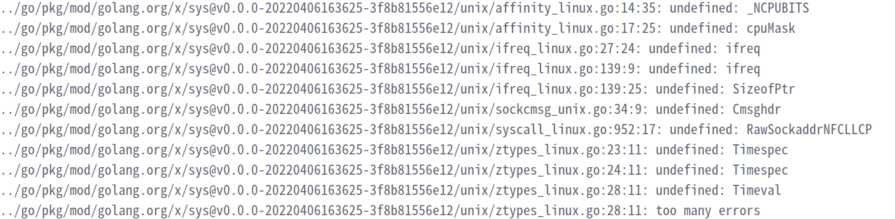

# 如何将本地文件夹链接到远程服务器上
```shell
     yum install sshfs
     sshfs user@ipaddr:/绝对路径 链接的文件夹路径
```

# vscode git 使用
``` shell
     git config --global/local user.name "name"
     git config --global/local user.email $@.com
```

# 局域网自签名配置方法
```shell
     sudo yum install nss-tools
             or  sudo apt install libnss3-tools
     git clone https://github.com/FiloSottile/mkcert && cd mkcert
     go build -ldflags "-X main.Version=$(git describe --tags)"
          golang 编译需要替换镜像源：export GOPROXY=https://goproxy.io   export GO111MODULE=on   否则会报错：i/o timeout
     ./mkcert -install     #将mkcert注册为本机认可的CA证书发布机构
     ./mkcert -cert-file $.crt -key-file $.key  ip1 ip2 ....     #生成证书及其密钥
     将生成的文件配置到对应位置（如ngix， apache等）
     ./mkcert -CAROOT  #寻找对应的根证书目录
     mv path/rootCA.pem  client /usr/local/share/ca-certificates    
     update-ca-certificates    #linux 更新CA证书.
     #对于chorme浏览器等，需要导入证书。
```
# rpm打包
1. 安装rpm打包工具
```shell
yum/apt install rpm-build rpmdevtools  
```
2. 建立rpmbuild相关文件夹
```shell
rpmdev-setuptree
```
|       默认位置       |     宏代码     |       名称        |                     用途                     |
| :------------------: | :------------: | :---------------: | :------------------------------------------: |
|   ~/rpmbuild/SPECS   |   %_specdir    |     文件目录      |         保存 RPM 包配置（.spec）文件         |
|  ~/rpmbuild/SOURCES  |  %_sourcedir   |    源代码目录     |  保存源码包（如 .tar 包）和所有 patch 补丁   |
|   ~/rpmbuild/BUILD   |   %_builddir   |     构建目录      | 源码包被解压至此，并在该目录的子目录完成编译 |
| ~/rpmbuild/BUILDROOT | %_buildrootdir |   最终安装目录    |         保存 %install 阶段安装的文件         |
|   ~/rpmbuild/RPMS    |    %_rpmdir    |  标准 RPM 包目录  |            生成/保存二进制 RPM 包            |
|   ~/rpmbuild/SRPMS   |  %_srcrpmdir   | 源代码 RPM 包目录 |          生成/保存源码 RPM 包(SRPM)          |
3. 将源码包放在SOURCES目录下
4. 编写.spec(相当于gcc的makefile)，放置在SPECS文件夹下
5. 编译打包
`rpmbuild -ba/bb/bs ～/rpmbuild/specs/*.spec `
`-ba`: 打包二进制包和源码包
`-bb`: 打包为二进制包
`-bs`: 打包为源码包
# 缓存释放
```shell
sync
echo 1 > /proc/sys/vm/drop_caches
```
# 逻辑关核
```shell
######只允许一路CPU运行
for test in {16..63}
do
echo 0 > /sys/devices/system/cpu/cpu${test}/online
done
#####开启所有CPU
for test in {0..63}
do
echo 1 > /sys/devices/system/cpu/cpu${test}/online
done

####绑定numa节点
numactl --cpunodebind=0-15 --membind=0-3=15 ./cpubench.sh 
```
# benchmarksql批量生成
```sql
name=$(ls |grep pgsql_shentong)
for i in $name; 
do 
    bash generateReport.sh $i; 
done;
```
# vim 
横向分割：:vsp  竖向分割：:sp   切换窗口： ctrl+w

# golang
1. 官方源无法访问
换源：export GOPROXY=https://goproxy.io
2. 编译中出现以下问题

原因在于编译时golang无法识别到系统的硬件信息，使用`sudo cp /usr/lib/golang-1.18/src/cmd/vendor/golang.org/x/sys/unix ../go/pkg/mod/golang.org/x/`帮助系统进行识别。