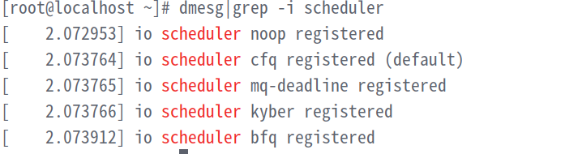
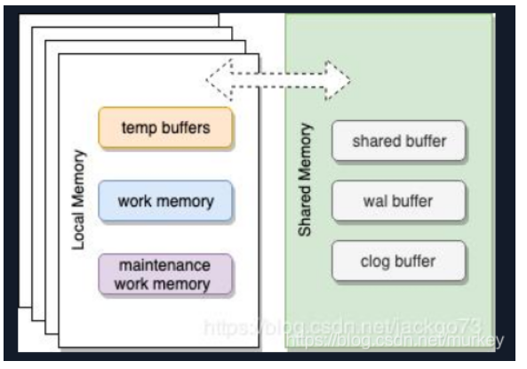
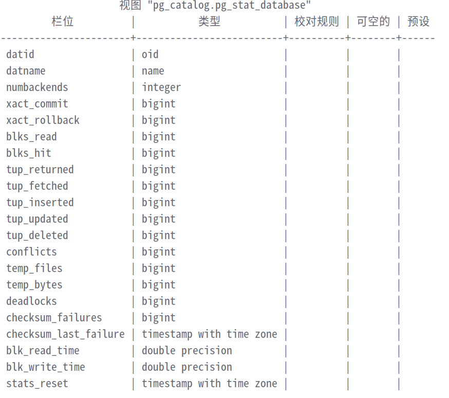
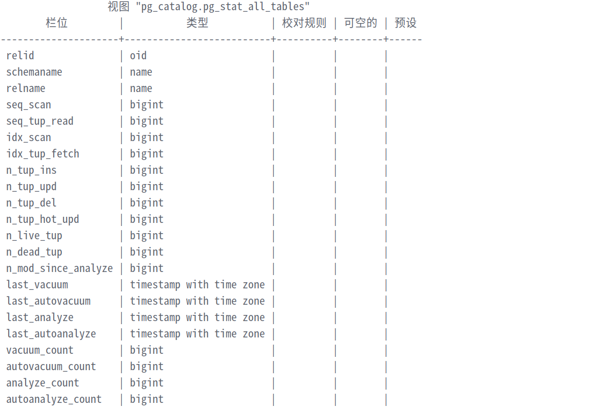
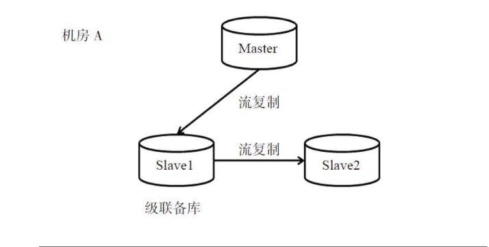
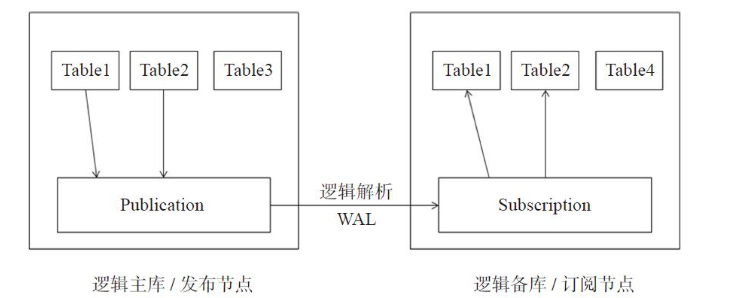

- [**PSQL**](#psql)
  - [psql扩展参数](#psql扩展参数)
  - [psql变量传递](#psql变量传递)
  - [psql定制日常维护脚本](#psql定制日常维护脚本)
    - [查询活动会话](#查询活动会话)
    - [查询会话等待事件](#查询会话等待事件)
    - [显示连接数选项](#显示连接数选项)
  - [psql其他命令](#psql其他命令)
  - [copy \& \\copy](#copy--copy)
    - [copy](#copy)
    - [\\copy](#copy-1)
- [sql查询](#sql查询)
  - [with 查询](#with-查询)
  - [批量插入](#批量插入)
  - [RETURNING](#returning)
  - [UPSERT](#upsert)
  - [抽样](#抽样)
  - [聚合函数](#聚合函数)
  - [窗口函数](#窗口函数)
- [事务](#事务)
  - [ACID](#acid)
  - [事务隔离等级](#事务隔离等级)
  - [mvcc多版本并发控制](#mvcc多版本并发控制)
  - [分区表](#分区表)
    - [分区表的意义](#分区表的意义)
    - [继承](#继承)
    - [传统分区表](#传统分区表)
      - [创建分区表](#创建分区表)
      - [添加分区](#添加分区)
      - [删除分区](#删除分区)
      - [分区表与普通表](#分区表与普通表)
    - [内置分区表](#内置分区表)
      - [创建分区表](#创建分区表-1)
      - [添加分区](#添加分区-1)
      - [删除分区](#删除分区-1)
      - [更新分区数据](#更新分区数据)
  - [json与jsonb](#json与jsonb)
    - [插入与查询](#插入与查询)
      - [插入](#插入)
      - [查询](#查询)
      - [全文搜索](#全文搜索)
- [pg性能](#pg性能)
  - [postgresql性能优化](#postgresql性能优化)
    - [服务器硬件](#服务器硬件)
      - [磁盘](#磁盘)
      - [CPU](#cpu)
      - [内存与网络](#内存与网络)
    - [操作系统](#操作系统)
      - [缓存释放](#缓存释放)
      - [i/o调度算法](#io调度算法)
      - [预读参数调整](#预读参数调整)
      - [内存优化](#内存优化)
    - [数据库调优](#数据库调优)
      - [数据库内存占用情况](#数据库内存占用情况)
      - [shared\_buffers](#shared_buffers)
      - [effective\_cathe\_size](#effective_cathe_size)
      - [wal\_buffers](#wal_buffers)
      - [work\_mem](#work_mem)
      - [autovacuum\_max\_worker](#autovacuum_max_worker)
      - [autovacuum\_vacuum\_scale\_factor](#autovacuum_vacuum_scale_factor)
      - [maintenance\_work\_mem \&\& autovacuum\_work\_mem](#maintenance_work_mem--autovacuum_work_mem)
      - [temp\_buffers](#temp_buffers)
      - [checkpoint\_timeout](#checkpoint_timeout)
      - [checkpoint\_completion\_target](#checkpoint_completion_target)
      - [checkpoint\_segments](#checkpoint_segments)
      - [max\_wal\_size](#max_wal_size)
    - [统计信息](#统计信息)
      - [pg\_stat\_database](#pg_stat_database)
      - [pg\_stat\_user\_tables](#pg_stat_user_tables)
      - [pg\_stat\_statements](#pg_stat_statements)
    - [执行计划](#执行计划)
      - [explain](#explain)
    - [索引管理](#索引管理)
  - [pg基准测试](#pg基准测试)
    - [关注点](#关注点)
    - [原则](#原则)
    - [pgbench测试](#pgbench测试)
      - [pgbench 初始化](#pgbench-初始化)
      - [pgbench内置脚本测试](#pgbench内置脚本测试)
      - [pgbench自定义脚本测试](#pgbench自定义脚本测试)
      - [其他选项](#其他选项)
- [pg深入学习](#pg深入学习)
  - [逻辑复制和流复制](#逻辑复制和流复制)
    - [异步流复制](#异步流复制)
      - [拷贝方式](#拷贝方式)
      - [pg\_basebackup](#pg_basebackup)
    - [同步流复制](#同步流复制)
    - [流复制监控](#流复制监控)
      - [pg\_state\_replication](#pg_state_replication)
      - [主备延迟监控](#主备延迟监控)
      - [pg\_stat\_wal\_receiver](#pg_stat_wal_receiver)
      - [相关系统函数](#相关系统函数)
    - [流复制主备切换](#流复制主备切换)
      - [判断主备状态](#判断主备状态)
      - [主备切换](#主备切换)
    - [延迟备库](#延迟备库)
    - [同步复制优选提交](#同步复制优选提交)
    - [级联复制](#级联复制)
    - [流复制维护](#流复制维护)
    - [逻辑复制](#逻辑复制)
      - [逻辑复制架构](#逻辑复制架构)
      - [逻辑复制部署](#逻辑复制部署)
  - [备份与恢复](#备份与恢复)
    - [增量备份](#增量备份)
      - [归档](#归档)
      - [基础备份](#基础备份)
      - [指定时间和还原点恢复](#指定时间和还原点恢复)

# **PSQL**
## psql扩展参数
+ `-t`参数通常和`-A`参数结合使用，这时仅返回数据本身    
  + `-A` 非对齐输出模式 返回的结果不会产生空行。
  + `-t` 只返回数据，而不产生返回字段名称及行数统计。
+ `-q`选项通常和`-c`或`-f`选项使用，在执行维护操作过程中，当输出信息不重要时，这个特性非常有用。   
  + `-q` 不显示输出信息
  + `-c` 执行sql语句（等同于 `--command=`）
  + `-f` 从文件中执行sql语句，如果使用了`-single transaction`或者`-1`选项，此时整个sql文件会被视作一个事务，若存在sql执行失败，则整个事务将要回滚。（等同于元命令`\i`）。
## psql变量传递
1. 使用元命令`\set`进行变量传递（psql连接数据库后操作）
```sql
\set v_id 1
select * from table_name where id=:v_id;
```
利用`\set [variables]`取消设置的变量
2. 使用`-v`参数传递变量（可以通过psql`-f`指定sql语句）
```sql
echo "select * from table_name where id =v_id;">a.sql
psql -v v_id=1 db_name user_name -f a.sql
```
## psql定制日常维护脚本
### 查询活动会话
```shell
test ! -f ~/.psqlrc & touch ~/.psqlrc
\set active_session 'select pid,usename,datname,query,client_addr from pg_s    tat_activity where pid <> pg_backend_pid() and state=\'active\' order by query;'
```
在psql连接客户端之后就可以利用`:active_session`查询活动会话。
### 查询会话等待事件
```shell
echo "\set wait_event 'select pid,usename,datname,query,client_addr,wait_event_type,wait_event from pg_stat_activity where pid <> pg_backend_pid() and wait_event is not null order by wait_event_type;'">>~/.psqlrc
```
在psql连接客户端之后就可以利用`:wait_event`查询会话等待事件。
### 显示连接数选项
```shell
echo "\set show_connections 'select datname,usename,client_addr,count(*) from pg_stat_activity where pid <> pg_backend_pid() group by 1,2,3 order by 1,2,4 desc;'">>~/.psqlrc
```
在psql连接客户端之后就可以利用`:show connections`查询数据库当前连接数。
## psql其他命令
+ `\timing on` 开启计时器功能 `\timing`关闭计时器功能
+ `\watch [second]`以second的间隔反复执行某一条命令。
+ 
## copy & \copy
+ 一般大数据利用`copy`操作，小表利用`\copy`操作
### copy
+ `copy` 只能用超级用户执行，普通用户执行会报错。
+ `copy`是sql命令，用于从服务器端导入/导出文件
  ``` sql
  copy table_name from '/path';  #导入
  copy table_name to '/path';    #导出
  copy (select * from table_name where column_name = $ ) to '/path'; #导出指定数据到文件
  copy table_name to '/path/xxx.csv' with csv header; #导出csv格式文件
  ```
### \copy
+ `\copy`是pg的元命令，可以利用普通用户进行执行。
  ```sql
  \copy table_name from '/path';  #导入
  \copy table_name to '/path';    #导出
  ```
# sql查询
## with 查询
1. 辅助查询，等同于创建一个临时表用于查询。
```sql
WITH t as (
    SELECT generate_series(1,3)
)
SELECT * FROM t;
```
2. 递归查询
```sql
WITH recursive t (x) as (
    SELECT 1
    UNION
    SELECT x + 1 
    FROM t
    WHERE x < 5)
    select sum(x) from t;
```
+ CTE可以简化SQL代码，减少SQL嵌套层数，提高SQL代码的可读性。
+ CTE的辅助语句只需要计算一次，在主查询中可以多次使用。
+ 当不需要共享查询结果时，相比视图更轻量。
## 批量插入
+ `INSERT INTO table_name SELECT...FROM source_table`   
  + `INSERT INTO table_name SELECT...FROM source_table WHERE conditions` *插入部分数据*
+ `INSERT INTO table_name VALUES (),(),();`
+ `COPY `或者`\copy`[见上文]
## RETURNING
+ `INSERT/UPDATE/DELETE INTO/FROM table_name xxxx RETURNING *`返回插入/更新/删除的数据字段
## UPSERT
+ PostgreSQL的UPSERT特性是指`INSERT...ON CONFLICT UPDATE`，用来解决在数据插入过程中数据冲突的情况。
  ```SQL
  CREATE TABLE user_logins(user_name text primary key,login_cnt int4,last_login_time timestamp(0) without time zone)

  INSERT INTO user_logins(user_name,login_cnt) VALUES ('material',1),('francs',1)
  ON CONFLICT(user_name)    
  DO UPDATE SET login_cnt=user_logins.login_cnt+EXCLUDED.login_cnt,last_login_time=now();
  ```
+ 使用DO NOTHING可以忽略冲突的操作而不使事务发生回滚。
## 抽样
+ **system 抽样**（数据块抽样，抽取的数据在一个数据块上,抽取比例为n%）
  **`SELECT * FROM table_name TABLESAMPLE SYSTEM(0.01)`**
  计算抽取到的数据大小：
   `SELECT relname,relpages FROM pg_class WHERE relname='table_name';`获取表实际占用数据块的数量num
   `实际抽样的数量=total_count()/num`（如果该数量小于`total_count()*抽样比例`，则可能返回多个数据块）
+ **BERNOULLI抽样**(行级抽样)
`SELECT * FROM table_name TABLESAMPLE BERNOULLI (0.01);`
## 聚合函数
1. string_agg函数
`SELECT string_agg(column_name,'delimiter') FROM table_name;`
2. array_agg函数
`SELECT  array_agg(column_name) FROM table_name;`
## 窗口函数
窗口函数使用方法
`function_name ...window_function()/agg_function() over(partition by $ order by $ asc/desc)`
+ **row_number()**  :`row_number()`窗口函数对结果集分组后的数据标注行号，从1开始。
+ **rank()** :`rank()`窗口函数和`row_number()`窗口函数相似，主要区别为当组内某行字段值相同时，行号重复并且行号产生间隙。
+ **dense_rank()** ：`dense_rank()`窗口函数和`rank()`窗口函数相似，主要区别为当组内某行字段值相同时，虽然行号重复，但行号不产生间隙。
+ **lag()** :获取行偏移offset那行某个字段的数据。
+ `lag(column_name,offset,default_sign)`    
  offset:正数表示向上偏移，负数标识向下偏移，默认值为1.
  default_sign:偏移后未被标记的行的lag值，默认为空。
+ **first_value()** :`first_value()`窗口函数用来取结果集每一个分组的第一行数据的字段值。
+ **last_value()** :last_value()窗口函数用来取结果集每一个分组的最后一行数据的字段值。
+ **nth_value()** :nth_value(column_name,nth)窗口函数用来取结果集每一个分组的指定行数据的字段值
# 事务
## ACID
+ A(atomicity):原子性。一个事务的所有操作，要么全执行，要么全部不执行。
+ C(consistency):一致性。执行事务时数据库从一个一致的状态转向另一个一致的状态。
+ I(isolation):隔离性。每个事务都能保证一致性和原子性，各个事务并行执行不可互相影响。
+ D(durability):持久化。一旦事务提交则进行永久修改，数据库意外关闭也不会影响数据的存储。
## 事务隔离等级
1. **脏读**。第一个事务读取了第二个事务已修改但未提交的变动，当第二个事务发生回滚之后，第一个事务读取到的数据是不正确的，这种现象称之为脏读。

|             transaction 1             |             transaction 2             |
| :-----------------------------------: | :-----------------------------------: |
| `id=1,val=1`<br>`begin transaction1;` |                                       |
|                                       | `id=1,val=1`<br>`begin transaction2;` |
|                                       | `update table set val=10 where id=1;` |
|  `select val from table where id=1;`  |                                       |
|                                       |              `rollback;`              |

2. **不可重复读**。当一个事务对一个数据项进行读取之后，另一个已提交的事务对该数据项进行了修改，当前一个事务再次对这个数据项进行读取之时，两次读取的数据不匹配，这种现象称之为不可重复读。

|             transaction 1             |                   transaction 2                    |
| :-----------------------------------: | :------------------------------------------------: |
| `id=1,val=1`<br>`begin transaction1;` |                                                    |
|  `select val from table where id=1;`  |       `id=1,val=1`<br>`begin transaction2;`        |
|                                       | `update table set val=10 where id=1;`<br>`commit;` |
|  `select val from table where id=1;`  |                                                    |

3. 幻读指一次事务两次查询的结果集的数目不一样。可以认为幻读是因插入或者删除数据而产生的不可重复读。

|             transaction 1             |                 transaction 2                  |
| :-----------------------------------: | :--------------------------------------------: |
| `id=1,val=1`<br>`begin transaction1;` |                                                |
| `select val from table where val=1;`  |     `id=1,val=1`<br>`begin transaction2;`      |
|                                       | `insert into table values (2,1);`<br>`commit;` |
| `select val from table where val=1;`  |                                                |
+ Read Uncommitted（读未提交）：在该隔离级别，所有事务都可以看到其他未提交事务的执行结果，在多用户数据库中，脏读是非常危险的，在并发情况下，查询结果非常不可控，即使不考虑结果的严谨性只追求性能，它的性能也并不比其他事务隔离级别好多少，可以说脏读没有任何好处。所以未提交读这一事务隔离级别很少用于实际应用。<font color=#dd0000>pg中不存在该事务隔离等级</font>
+ Read Committed（读已提交）：这是PostgreSQL的默认隔离级别，它满足了一个事务只能看见已经提交事务对关联数据所做的改变的隔离需求。
+ Repeatable Read（可重复读）：确保同一事务的多个实例在并发读取数据时，会看到同样的数据行。
+ Serializable（可序列化）：这是最高的隔离级别，它通过强制事务排序，使之不可能相互冲突，从而解决幻读问题。简言之，它是在每个读的数据行上加上共享锁。在这个级别，可能导致大量的超时现象和锁竞争。
  
|     隔离级别     | 脏读  | 不可重复读 | 幻读  |
| :--------------: | :---: | :--------: | :---: |
| Read Uncommitted | maybe |   maybe    | maybe |
|  Read Committed  | never |   maybe    | maybe |
| Repeatable Read  | never |   never    | maybe |
|   Serializable   | never |   never    | never |
+ 查看pg事务隔离等级
`SELECT name,setting FROM pg_settings WHERE name = 'default_transaction_isolation';`
+ 修改pg事务隔离等级    
  1. 通过修改postgresql.conf文件中的default_transaction_isolation参数修改全局事务隔离级别，修改之后reload实例使之生效；
  2. `ALTER SYSTEM SET default_transaction_isolation TO 'REPEATABLE READ';`
     `SELECT pg_reload_conf();`
+ 查询当前会话的事务隔离等级
`SHOW transaction_isolation ;`
or
`SELECT current_setting('transaction_isolation');`
+ 设置当前会话的事务隔离等级
`SET SESSION CHARACTERISTICS AS TRANSACTION ISOLATION LEVEL READ UNCOMMITTED;`
+ 设置当前事务的事务隔离等级
`START TRANSACTION ISOLATION LEVEL READ UNCOMMITTED;`
or
`BEGIN ISOLATION LEVEL READ UNCOMMITTED READ WRITE; `
## mvcc多版本并发控制
| xmin  | 创建该记录的事务id |
| :---: | :----------------: |

| xmax  | 删除该记录的事务id |
| :---: | :----------------: |
1. 若xmin标识的事务未提交或者已回滚，则当前的记录对其他事务不可见。
2. 若当前记录xmin大于事务a的xmin，则该记录对事务a不可见。
3. 若该记录的xmax为0或者xmax对应的事务id已回滚或正在运行，则该记录对所有的事务都可见。
4. 若该记录的xmax对应的事务已提交，则该记录对xmax以后的所有事务都不可见。
## 分区表
### 分区表的意义
1. 减少大表的储存成本，可以将大表不常用的部分拆分到多个廉价存储设备进行储存。
2. 在某些场景下提升数据库查询性能。
3. 更利于批量删除等操作。
### 继承
```sql
create table father_table (id int);
create table son_table(sql_text text) inherits(father_table);
```
+ 子表除了从父表继承父表的字段，还可以额外的增加新的字段，如sal_text。
+  查询父表会对父表和子表进行一并查询，但不会看到子表新增的字段，对父表的DML操作会对子表起同样的效应。利用only字符可以只查询父表
`select * from only father_table;`
查询子表不会看到父表的数据。
### 传统分区表
#### 创建分区表
1. 创建父表，父表中不插入任何数据，不定义除全局约束外的任何约束。
2. 通过继承的方式创建子表，子表字段应当与父表保持一致。
3. 给所有的子表创建约束，约束范围不要有重叠。
4. 为所有子表创建索引，子表不会继承父表的索引。
5. 在父表上设立`update`、`delete`、`insert`的触发器。
6. 在父表上启用`constraint_exclusion`参数。
```sql
---------1
create table father_table(id int, count int);
alter table father_table add constraint CK_1 check(count<=20);
--------2,3
create table son_table1(check (count<=0)) inherits(father_table);
create table son_table2(check(count>0 and count<=10)) inherits(father_table);
create table son_table3(check(count>10 and count<=20)) inherits(father_table);
---------4
create index idx_count_son1 on son_table1 using btree(count);
create index idx_count_son2 on son_table2 using btree(count);
create index idx_count_son3 on son_table3 using btree(count);
---------5
create or replace function count_insert_trigger()
    returns trigger
    language plpgsql
as $function$
begin
    if (new.count<=0) then
        insert into son_table1 values(new.*);
    elsif (new.count>0 and new.count<=10) then
        insert into son_table2 values(new.*);
    elsif (new.count<=20 and new.count>10) then
        insert into son_table3 values(new.*);
    else
        raise exception 'the count will be insert is out of range,please fix the insert function or modify the constraint to continue.';
    end if;
    return null;
end;
$function$;
create trigger count_insert_trigger before insert on father_table for each row execute procedure count_insert_trigger();
-------6
show constraint_exclusion;   #默认为partition
set constraint_exclusion=partition; #如果该参数为off状态
```
+ 一般应用上直接对子表进行查询，会比查询父表具有更好的性能。
+ constraint_exclusion 有三种状态，on标识对所有语句进行约束优化查询，partition标识对子表及union all子查询进行约束优化查询，off标识不进行约束优化查询。
#### 添加分区
```sql
-----1 创建分区
create son_table$ like(father_table including all);
-----2 添加约束
alter table son_table$ add constranit name$ check(check condition);
-----3 刷新触发器函数
create or replace function......
-----4 将新分区继承到父表
alter table son_table$ inherits(father_table);
```
#### 删除分区
+ 为保证分区表的安全性，不直接对要删除的分区进行drop操作。
`alter table son_table$ no inherits(father_table);`
#### 分区表与普通表
+ 分区表根据非分区键查询相比普通表性能差距较大，因为这种场景分区表的执行计划会扫描所有分区；
+ 分区表根据分区键查询相比普通表性能有小幅降低，而查询分区表子表性能比普通表略有提升；
+ **分区表的应用场景**：如果业务模型90%（估算的百分比，意思是大部分）以上的操作都能基于分区健操作，并且SQL可以定位到子表，这时建议使用分区表。
### 内置分区表
#### 创建分区表
创建主表标准语句：
`CREATE TABLE table_name ( ... )
    [ PARTITION BY { RANGE | LIST } ( { column_name | ( expression ) }
`
创建分区表标准语句：
`CREATE TABLE table_name
    PARTITION OF parent_table [ (
    ) ] FOR VALUES partition_bound_spec`
1. 创建父表，指定分区键和分区策略
2. 创建分区，创建分区时须指定分区表的父表和分区键的取值范围，注意分区键的范围不要有重叠，否则会报错。
3. 在分区上创建相应索引，通常情况下分区键上的索引是必须的，非分区键的索引可根据实际应用场景选择是否创建.
```sql
--------1
create table father_table(id int ,count int) partition by range(count);
--------2
create table son_table1 partition of father_table for values from(minvalue) to (0);
create table son_table2 partition of father_table for values from(0) to (maxvalue);
--------3
create index idx_count_son1 on son_table1 using btree(count);
create index idx_count_son2 on son_table2 using btree(count);
```
#### 添加分区
+内置分区表可以直接添加分区
```sql
create table partition_table partition of father_table values from(start_value) to (end_value);
create index partition_index on partition_table using btree(count);
```
#### 删除分区
1. 直接弃置分区表（不建议使用）
```sql
drop table partition_table;
```
2. 将分区表与父表解绑，保留表内数据
``` sql
alter table father_table detach partition partition_table;
```
>*需要使用时将分区表链接回父表*
```sql
alter table father_table attach partition_table for values from(start_value) to (end_value);
```
#### 更新分区数据
>**更新分区数据不能违反当前区表的范围约束**
## json与jsonb
### 插入与查询
+ 就插入速度而言，json格式的数据插入比jsonb格式的数据插入更快。就查询速度而言，jsonb格式储存的文件更有利于查询任务的进行。
#### 插入
```sql
create table user_ini(id int4,user_id int8,user_name varchar(64)); # 建立一个用户表
insert into user_ini(id,user_id,user_name) select r,round(random()*2000000),r||'_name' from generate_series(1,2000000) as r;# 向用户表中插入随机生成的2000000条数据。
create table test_json(id serial,user_info json); #建立json测试表
create table test_jsonb(id serial,user_info jsonb); #建立jsonb测试表
insert into test_json(user_info) select row_to_json(user_ini) from user_ini; #将user_ini数据转化为json插入json表中
insert into test_jsonb(user_info) select row_to_json(user_ini)::jsonb from user_ini; #将user_ini数据转化为jsonb插入jsonb表中
```
#### 查询
```sql
create index btree_on_username on test_json using btree((user_info->>'user_name')); #为json表建立b树索引
SELECT * FROM test_json WHERE user_info->>'user_name'='1_name'; #走btree索引的查询方式
create index gin_on_username on test_jsonb using gin(user_info);
#为jsonb表建立gin索引
select * from test_jsonb where user_info @>'{"user_name":"2_name"}';
```
#### 全文搜索
+ `tsvector` 全文搜索数据类型
+ `tsquery` 全文搜索查询类型
```sql
create index gin_on_userinfo on test_jsonb using gin(to_tsvector('english',user_info)); #创建全文搜索的索引
select * from test_jsonb where to_tsvector('english',user_info) @@ to_tsquery('english','1_name'); #走全文搜索索引的查询
```
<font color="dd0000">使用tsvector函数创建索引之时，要将其作为双参数函数输入，不能省略第一个语言参数，否则会报错'错误:  索引表达式中函数必需标记为 IMMUTABLE'。</font>

# pg性能
## postgresql性能优化
### 服务器硬件
#### 磁盘
+ 在读写密集型的场景下选用企业级ssd
#### CPU
+ bios中禁用CPU节能模式，防止cpu性能出现波动
#### 内存与网络
+ 在服务器上一般不会成为瓶颈，但需要提供足够的内存和网络带宽。
### 操作系统
+ `yum install -y sysstat` 安装系统监测工具
+ `yum install -y glances`
+ 利用top、glances、htop、iftop、sar、vmstat、nmon等系统监测工具对系统状况进行实时监测。
#### 缓存释放
```shell
sync
echo 1/2/3> /proc/sys/vm/drop_caches
# 数字越大，清理级别越高
```
#### i/o调度算法
+ `dmesg | grep -i scheduler` 查看当前系统支持的i/o调度算法

1. 默认算法为cfq算法（绝对公平调度），为每一个进程/线程创建一个队列管理io，将i/o带宽均匀的分配。
2. noop（电梯调度）算法，基于fifo队列的算法，所有请求先进先出，适用于ssd、闪存设备，RAM，嵌入式系统。【倾向于饿死读而利于写】
3. deadline（绝对保障）算法，为读和写分别创建了FIFO队列，当内核收到请求时，先尝试合并，不能合并则尝试排序或放入队列中，并且尽量保证在请求达到最终期限时进行调度，避免有一些请求长时间不能得到处理，适合虚拟机所在宿主机器或I/O压力比较重的场景，例如数据库服务器。【mq标识多队列】
4. bfq算法，用于替代cfq算法，具有高吞吐、低延迟的特点
5. kyber算法，通过维护4个队列（read，write，discard，others以16：8：8：1的比例进行调度）。
```shell
#寻找io调度配置所在的位置
find / -name scheduler 
#以龙芯为例，查看当前磁盘的io调度策略：
cat /sys/devices/pci0000:00/0000:00:09.0/0000:01:00.0/nvme/nvme0/nvme1n1/queue/scheduler
cat /sys/devices/pci0000:00/0000:00:13.0/0000:08:00.0/nvme/nvme1/nvme0n1/queue/scheduler
#暂时修改调度策略
echo mq-deadline > /sys/devices/pci0000:00/0000:00:13.0/0000:08:00.0/nvme/nvme1/nvme0n1/queue/scheduler
```
#### 预读参数调整
```shell
#### 查看磁盘扇区预读参数
/sbin/blockdev --getra /dev/sda
#### 设置磁盘扇区预读参数
/sbin/blockdev --setra 16384 /dev/sda
```
为防止重启失效，可以将配置写入/etc/rc.local文件
`echo "/sbin/blockdev --setra 16384 /dev/sda" >> /etc/rc.local`
#### 内存优化
1. swap
+ 使用`free -h`查看是否已经使用到了swap
+ `swapoff -a` && `swapon -a` 即可清空交换区数据
2. 透明大页
透明大页对于数据库服务器的动态分配内存不够友好，应当将其禁用。
```shell
#查看透明大页
cat /sys/kernel/mm/transparent_hugepage/enabled
#暂时禁用透明大页
echo never > /sys/kernel/mm/transparent_hugepage/enabled
#永久禁用透明大页，在/etc/rc.loacl中添加
if test -f /sys/kernel/mm/transparent_hugepage/enabled; then
    echo never > /sys/kernel/mm/transparent_hugepage/enabled
fi
if test -f /sys/kernel/mm/transparent_hugepage/defrag; then
    echo never > /sys/kernel/mm/transparent_hugepage/defrag
fi
```
3. NUMA 
【目前龙芯不支持关闭numa】
numa的关闭方法: 
```shell
#solution1
grubby --update-kernel=ALL --args="numa=off"
reboot
#solution2
编辑/etc/default/grub文件，在 GRUB_CMDLINE_LINUX参数中添加numa=off。
grub2-mkconfig -o /etc/grub2.cfg
reboot
```
### 数据库调优
#### 数据库内存占用情况

在Postgresql中，内存大概被分为两块
+ Local memory area – 为每一个backend process 分配的内存
+ Shared memory area – PostgreSQL server 所有的backgroud process使用的内存
1.  Local memory area
每一个backend process 都会分配一块local memory area, 每一块区域又分为三个子区域 ，见下表

|       sub-area       |                          description                          |
| :------------------: | :-----------------------------------------------------------: |
|       work_mem       | 用户在sort,distinct,merge join，hash join的时候会用到这块区域 |
| maintenance_work_mem |                 vacuum，reindex会用到这块区域                 |
|     temp_buffers     |                   存储临时表会用到这块区域                    |
2. Shared memory area
这块区域在服务器启动的时候分配,所有的session共享这块区域。

|      sub-area      |                                       description                                       |
| :----------------: | :-------------------------------------------------------------------------------------: |
| shared buffer pool |          将表或者索引的page从磁盘加载到shared buffer，然后在shared buffer操作           |
|     WAL buffer     | 在服务端出现问题的时候，确保数据不会丢失，在写到磁盘之前，wal buffer是wal log的缓存区域 |
|     commit log     |                      为了并发控制所有事物的状态的保持而分配的区域                       |
<font color="#ffff00">一般来说，系统的RAM大小需要大于connections*work_mem+maintenance_work_mem+temp_buffers+shared_buffers+操作系统正常运行所需要的内存</font>
#### shared_buffers
服务器优先在共享内存中寻找数据匹配，如果未寻找到，会从磁盘中进行读取，这样就会增大代价。pg默认shared_buffres大小为128MB，在实际应用中该值过于保守，一般给到内存大小的1/4左右。
<font color="#dd0000">以龙芯256GB内存为例，设置shared_buffres=64GB。</font>

#### effective_cathe_size
effective_cache_size提供可用于磁盘高速缓存的内存量的估计值。它只是一个建议值，而不是确切分配的内存或缓存大小。它不会实际分配内存，而是会告知优化器内核中可用的缓存量。在一个索引的代价估计中，更高的数值会使得索引扫描更可能被使用，更低的数值会使得顺序扫描更可能被使用。一般将该数值给到服务器运行内存的50%左右，最大给75%.
<font color="#dd0000">以龙芯256GB内存为例，设置effective_cache_size=128GB。</font>

#### wal_buffers
PostgreSQL将其WAL（预写日志）记录写入缓冲区，然后将这些缓冲区刷新到磁盘。由wal_buffers定义的缓冲区的默认大小为16MB，但如果有大量并发连接的话，则设置为一个较高的值可以提供更好的性能。
<font color="#dd0000">以龙芯256GB内存为例，设置wal_buffers=16MB。</font>

#### work_mem
此配置用于复合排序。内存中的排序比溢出到磁盘的排序快得多，设置非常高的值可能会导致部署环境出现内存瓶颈，因为此参数是按连接数排序操作。如果有多个连接尝试执行排序操作，则系统将为所有分配大小为work_mem *连接数的空间。pg默认大小为4MB。提高该参数大小可以提升排序性能，但过大会占用大量空间。
<font color="#dd0000">以龙芯256GB内存为例，设置work_mem=32MB。</font>

#### autovacuum_max_worker
用于自动垃圾处理的最大工作数，pg默认数量为3个。
#### autovacuum_vacuum_scale_factor
用于评估空间清理程序启动条件的参数，当一个表中无效元组的比例达到该设定值之时，会对表空间进行回收利用。pg默认的值为0.2,即20%。减小该值可以使系统自动清理更加频繁，对于大表而言会显著提升性能，增大该值会减少自动清理调度的次数，但需要更大的maintenance_work_mem，且对大表不利。
<font color="#dd0000">以龙芯256GB内存为例，设置autovaccum_vacuum_scale_factor=0.01。</font>

#### maintenance_work_mem && autovacuum_work_mem
maintenance_work_mem是用于维护任务的内存设置。默认值为64MB。    
在pg9.4版本以后出现了一个新的参数autovacuum_work_mem同maintenance_work_mem作用一致，但该参数的默认值为-1,即不生效，此时系统会调用maintenance_work_mem。 
系统用于autovacuum的最大空间大小为maintenance_work_mem* autovacuum_max_worker,故而该参数不宜设置过大，以免空间不足。    
**maintenance_work_mem大小应大于最大的表的元组数× autovacuum_vacuum_scale_factor×6**
+ 元组数=表所占磁盘大小/平均每行数据所占的大小
+ 一个无效元组占用6个字节    

<font color="#dd0000">以龙芯256GB内存为例，设置maintenance_work_mem=1GB。</font>

#### temp_buffers
临时缓冲区，用于数据库会话访问临时表数据。可以在单独的session中对该参数进行设置，尤其是需要访问比较大的临时表时，将会有显著的性能提升。pg默认的大小为8MB
<font color="#dd0000">以龙芯256GB内存为例，设置temo_buffers=32MB。</font>

#### checkpoint_timeout
postgresql检查点设置的参数之一，用于规定postgresql检查基于时间进行checkpoint操作的间隔。
以下是postgresql触发checkpoint操作的情况：
+ 用户手动执行checkpoint操作
+ 执行了需要checkpoint的命令（例如：`pg_start_backup`，`CREATE DATABASE`，或`pg_ctl stop|restart`和其他一些命令）。
+ 自上一个检查点以来已达到配置的时间（会被其他行为导致的checkpoint更新）
+ 自上一个检查点以来生成了已配置的最大WAL文件数量（也称为WAL用尽（running out of WAL）或填充WAL（filling WAL））

非常频繁地执行检查点操作，将只保留非常少量的WAL日志，恢复速度也非常快（只需重放很少量的WAL日志），但这也会把对数据文件的异步写入转换为类似同步写入，从而增加COMMIT的延迟，降低系统的吞吐量。
checkpoint_timeout时间设置过长，一是需要更大的系统空间存储wal日志，二是可能不利于系统恢复，存在系统数据丢失的风险。
pg默认的checkpoint_timeout为5分钟。
<font color="#dd0000">以龙芯256GB内存为例，设置checkpoint_timeout=30min。</font>

#### checkpoint_completion_target
该参数表示用于checkpoint完成的目标，以checkpoint_timeout=5min为例，若checkpoint_completion_target=0.5,则有2.5分钟可用于checkpoint刷盘。实际上该参数越大，则在checkpoint进程中休眠的发生的机会越多，能显著降低i/o压力，但当该参数等于1时可能会推迟下一次checkpoint的发生。
<font color="#dd0000">以龙芯256GB内存为例，设置checkpoint_completion_target=0.9。</font>

#### checkpoint_segments
用于指定pg产生多少WAL日志后，进行一次checkpoint,是根据修改量评估是否进行checkpoint操作的参数。设置过小会导致pg频繁checkpoint，影响pg性能，设置过大会导致两次checkpoint间文件文件过多刷盘较慢，甚至可能导致数据丢失。该参数目前已弃用，目前由max_wal_size进行控制。
#### max_wal_size
max_wal_size是pg最大用于存储wal日志的物理盘大小，该限制为软限制，并不严格保证wal日志不会超出该大小，数据库将尝试不超过该限制，但超过它是可以的，因此请在分区文件系统上配置足够的可用空间并对其进行监控。
其次，这并不是针对“每个检查点”的限制，由于检查点是分散的，WAL日志的配额会在2-3个检查点之间分配。
max_wal_size大小决定了每次checkpoint之间最大段的数量,即checkpoint_segments的大小。
 <font color="#dd0000">以龙芯256GB内存为例，设置max_wal_size=20GB。</font>

 ### 统计信息
 #### pg_stat_database
 数据库级统计信息

```sql
# 计算缓存命中率，理论应当接近1，若低于0.99,尝试增大shared_buffers
SELECT blks_hit::float/(blks_read + blks_hit) as cache_hit_ratio FROM pg_stat_database WHERE datname=current_database();
# 计算事务提交率，理论应当接近1
SELECT xact_commit::float/(xact_commit + xact_rollback) as successful_xact_ratio FROM pg_stat_database WHERE datname=current_database();
```
完成参数调整或者数据库优化之后，执行`select pg_stat_reset();`重置分析数据。
#### pg_stat_user_tables
表级统计信息

```sql
# 计算索引扫描相对于顺序扫描的比列，理论上应当接近1,过低应当考虑重建索引。
SELECT relname,idx_scan::float/(idx_scan+seq_scan+1) as idx_scan_ratio FROM pg_stat_all_tables WHERE schemaname='postgres' ORDER BY idx_scan_ratio ASC;
```
#### pg_stat_statements
语句级统计信息
+ 开启语句级统计信息
```shell
1.编辑postgresql.conf文件
shared_preload_libraries = 'pg_stat_statements'
pg_stat_statements.track = all
2.在库内启用扩展
CREATE EXTENSION pg_stat_statements;
```
### 执行计划
#### explain
查询计划，用于估算执行成本，但可能存在偏差。利用`explain analyze`可以获取到真实的查询计划，但注意利用事务进行该活动，避免对数据产生影响。
```sql
begin;
explain analyze ....;
rollback;
```
### 索引管理
+ 使用CONCURRENTLY参数在阻塞表的更新、插入、删除的情况下建立索引（速度较慢）
`create index concurrently index_name on schema.table_name(col_name) using(index_category);`
+ 传统索引和concurrently的区别  
  1. create index concurrently是在线创建索引，不堵塞其他会话对被创建索引表的DML操作，适合生产业务
  2. 如果使用concurrently创建索引等待时间过长，强制结束后，索引已经被创建了，但是状态标记为invalid状态，需要重建
  3. create index传统的创建索引的方式会堵塞其他会话的DML
  4. 传统创建建索引时DB只扫描一次表
  5. concurrently创建索引，会引发DB扫两次表，同时等待所有潜在会读到该索引的事务结束，系统的CPU和IO,内存等会受一些影响。

## pg基准测试
### 关注点
1. 吞吐量
一般以tps进行衡量，反映数据库数据库的单位时间内的事务处理能力。
2. 响应时间
一般以平均响应时间和95%响应时间为准
3. 并发数
同时工作的连接数，反映了数据库的负载能力。
### 原则
1. 控制变量
排除多因素的影响，可以得到直观而明确的结果
2. 持续一定的时间
如果测试时间太短，则可能因为没有缓存而得到不准确的测试结果
3. 贴近实际应用场景
4. 记录系统信息
包括系统cpu状态、磁盘io、网络负载、参数配置等信息。
### pgbench测试
#### pgbench 初始化
`pgbench -i [options] [database]`
`-i`: initialize
`-F`: fillfactor,填充因子，默认大小为100，当该值小于100时，可适当提升UPDATA性能
`-n`：no-vacuum，初始化不做vacuum处理
`-q`: quiet,静默模式。每5秒打印一条信息
`-s`: scale，数据仓数
`--unlogged-tables`：使用无日志表
初始化命令：`pgbench -i -s n -F n -h pghost1 -p 1921 -U pguser -d mydb`
#### pgbench内置脚本测试
默认有3种测试模式，分别为`tpcb-like`，`select-only`，`simple-update`
使用方法如下：
```sql
# 以2：8的混合比列使用simple-update和select-only进行测试
pgbench -b simple-update@2 -b select-only@8 -b tpcb@0 -h pghost1 -p 1921 -U pguser mydb
```
**在使用过程中，可以通过缩写减少键入量，如-b se。**

#### pgbench自定义脚本测试
使用 `-f`使用自定义脚本，自定义脚本支持以下选项：
`\sleep number[us|ms|s]` 每执行一个事务的暂停时间，默认为s
`\set varname expression` 设置变量

#### 其他选项
`-c` 模拟客户端的数量（并发数）
`-T` 设置测试的持续时间
`-t` 设置测试的事务数。
`-L` 阈值，超出该值会进行统计。单位毫秒
`-d` debug（更多的信息）
`-P` 输出选项，num（以num的间隔输出）
**`-T`与`-t`两者取其一**

# pg深入学习
## 逻辑复制和流复制
逻辑复制：表级；不复制DDL操作；从库可读写；允许跨大版本复制
流复制：实例级；复制DDL操作；从库只读；不允许跨版本复制
### 异步流复制
#### 拷贝方式
1. 在主库中用具有流复制权限的用户执行：
`SELECT pg_start_backup('francs_bk1');`
2. 将主库文件压缩并发送至从库：
`tar -czvf pg_backup.tar.gz pgpath`
`scp pg_backup.tar.gz destination`
3. 在主库中执行
`SELECT pg_stop_backup();`
4. 修改配置文件
```
recovery_target_timeline = 'latest'
standby_mode = on
primary_conninfo = 'host=192.168.28.74  port=5432 user=repuser'
hot_standby=on
```
5. 配置.pgpass文件
`touch .pgpass``
`chmod` 0600 .pgpass`
.pgpass中配置：
`ip:port:databse:user:password`
#### pg_basebackup
见主从复制配置文档
### 同步流复制
以牺牲事务响应时间和数据库吞吐量为代价保证数据的一致和无损性。
同步流复制的配置绝大多数过程与异步流复制一致，但需要注意以下几个参数
**synchronous_commit**
>单实例
`on` 当数据库提交事务时，WAL先写入WAL BUFFER再写入WAL日志文件，数据库非常安全，但有性能损耗
`off` 提交事务时不需等待本地WAL BUFFER写入WAL日志后向客户端返回成功，当数据库宕机时最新提交的少量事务可能丢失，对于数据准确性没有非常精确要求同时追求数据库性能的场景建议设置成off。
`local` 同on一致

>流复制
`remote_write` 本地WAL已落盘，备库的WAL还在备库操作系统缓存中，也就是说只有一份持久化的WAL，这个选项带来的事务响应时间较低。
`on` 本地WAL已落盘，备库的WAL也已落盘，也就是说有两份持久化的WAL，但备库此时还没有完成重做，这个选项带来的事务响应时间较高
`remote_apply` 本地WAL已落盘，备库WAL已落盘并且已完成重做，这个设置保证了拥有两份持久化的WAL，同时备库也完成了重做，这个选项带来的事务响应时间最高

**配置参数**
从库中添加
```
recovery_target_timeline = 'latest'
standby_mode = on
primary_conninfo = 'host=192.168.28.74  port=5432 user=repuser application_name=standby_name'
hot_standby=on
```
主库中`synchronous_standby_names`值为从库中`application_name`的值，`synchronous_commit = on`或 `remote_apply`。
<font color="#dd0000">一主一备的情况下不使用同步流复制，因为这种情况当从库宕机后主库由于需要等待至少一个从库写入日志完成，会阻塞写操作</font>

### 流复制监控
#### pg_state_replication

|表项             | 作用|
|:---:|:---:|
|pid              | wal发送进程的进程号|
|usesysid         | wal发送进程的系统标识符|
|usename          | wal发送进程的数据库用户名|
|application_name | 连接wal发送进程的应用别名|
|client_addr      | 备库ip地址|
|client_hostname  | 备库主机名|
|client_port      |备库端口号|
|backend_start    | wal发送进程的启动时间|
|backend_xmin     | 备库通过hot_standby_feedback报告的最大已提交事务数
|state            | wal发送进程的状态|
|sent_lsn         | wal发送进程最近发送的wal日志位置|
|write_lsn        | 备库最近已写入的wal日志位置（操作系统缓存中）|
|flush_lsn        | 备库最近已写入的wal日志位置（已写入备库日志）|
|replay_lsn       | 备库最近应用的wal日志的位置|
|write_lag        |主库上WAL日志落盘后等待备库接收WAL日志并返回确认信息的时间（缓存）|
|flush_lag        | 主库上WAL日志落盘后等待备库接收WAL日志并返回确认信息的时间（日志）|
|replay_lag       | 主库上WAL日志落盘后等待备库接收WAL日志并返回确认信息的时间（应用）|
sync_priority    | 基于优先级的模式中备库被选中成为同步备库的优先级|
sync_state       | 同步状态|

#### 主备延迟监控
1. wal日志延迟时间监控
`SELECT pid,usename,client_addr,state,write_lag,flush_lag,replay_lag
           FROM pg_stat_replication ;`
一般有replay_lag > flush_lag > write_lag。    
2. wal日志延迟量监控
`SELECT pid,usename,client_addr,state,
        pg_wal_lsn_diff(pg_current_wal_lsn(),write_lsn) write_delay, pg_wal_lsn_diff(pg_current_wal_lsn(),flush_lsn) flush_delay,
        pg_wal_lsn_diff(pg_current_wal_lsn(),replay_lsn) replay_dely
    FROM pg_stat_replication ;`
#### pg_stat_wal_receiver

|表项             | 作用|
|:---:|:---:|
|pid                   | wal接收进程的进程id号|
|status                | wal接收进程的状态|
|receive_start_lsn     | WAL接收进程启动后使用的第一个WAL日志位置|
|receive_start_tli     | wal接收进程启动后第一个采用的时间线编号|
|received_lsn          | 最近接收并写入WAL日志文件的WAL位置|
|received_tli          | 最近接收并写入WAL日志文件的时间线编号|
|last_msg_send_time    | 备库接收到发送进程最后一个消息后，向主库发回确认消息的发送时间。|
|last_msg_receipt_time | 备库接收到发送进程最后一个消息的接收时间|
|latest_end_lsn        | 已向主库发送的最近的预写日志的位置|
|latest_end_time       | 向主库报告最近的预写日志的时间|
|slot_name             | wal日志接收进程使用的复制槽名称|
|conninfo              | WAL接收进程使用的连接串，连接信息由备库$PGDATA目录的recovery.conf配置文件的primary_conninfo参数配置|
#### 相关系统函数
```sql
# 查询pg是否处于恢复状态
SELECT pg_is_in_recovery();
# 显示备库最近接收的wal日志的位置
SELECT pg_last_wal_receive_lsn();
# 显示备库最近应用WAL日志的位置
SELECT pg_last_wal_replay_lsn();
# 显示备库最近事务的应用时间
SELECT pg_last_xact_replay_timestamp();
# 显示主库WAL当前写入位置
SELECT pg_current_wal_lsn();
# 计算两个WAL日志位置的偏移量
SELECT pg_wal_lsn_diff('wal1','wal2');
```
### 流复制主备切换
#### 判断主备状态
1. 系统内查看receiver或者sender进程
`ps -ef|grep "wal"|grep -v "grep"`
存在wal_receiver为备库，存在wal_sender为主库
2. 数据库内查看receiver或者sender进程
`select * from pg_stat_replication;`仅主库可查
`select * from pg_stat_wal_receiver;`仅备库可查
3. 通过系统函数查看
`select pg_is_in_recovery();`
返回t为备库，返回f为主库。
4. 查看数据库控制信息
`pg_controldata | grep cluster`
in production 表示为主库，in archive recovery表示为从库。
5. 通过查看recovery.conf
pg 9.6版本以前若存在该文件则为从库；pg 9.6版本以后通过查看recovery.signal来确认

#### 主备切换
**9.0 版本**
1. 修改备库的recovery.conf文件，添加trigger_file的参数。
```
recovery_target_timeline = 'latest'
standby_mode = on
primary_conninfo = 'host=maste_host  port=5432 user=user_name'
trigger_file = '/{pg_path}/.postgresql.trigger.5432'
```
2. 关闭主库
`pg_ctl stop -m fast`
3. 去备库trigger_file的位置建立文件
```
cd {pg_path}
touch ./.postgresql.trigger.5432
```
如果recovery.conf变为recovery.done，标志主备切换成功。
4. 在老的主库下创建recovery.conf文件，并将连接信息串写入。
5. 启动老的主库，观察主备是否正常运行。

**pg_promote**
1. 关闭主库
`pg_ctl stop -m fast`
2. 使用pg_promote提升备库为主库
`pg_ctl promote -D data_dir`
如果recovery.conf变为recovery.done，标志主备切换成功。
3. 在老的主库下创建recovery.conf文件，并将连接信息串写入。
4. 启动老的主库，观察主备是否正常运行。

**pg_rewind**
当提升备库作为主库之时，如果没有提前将主库关闭，会形成双主库的现象，且老的主库不可在通过修改recovery.signal做为备库加入，如需形成主，要么重新备份备库，要么使用pg_rewind工具。
pg_rewind使用的前提条件以下两者必须满足其中一个：
1. 在postgresql.conf中设置wal_log_hints = on（重启后生效）
2. 数据库安装时通过initdb初始化数据库时使用了--data-checksums选项
pg_rewind使用：
1. 使用pg_promote提升备库为主库
`pg_ctl promote -D data_dir`
如果recovery.conf变为recovery.done，标志主备切换成功
2. 使用pg_rewind将新主库与老的主库进行增量同步
`pg_rewind --target-pgdata $PGDATA --source-server= 'host= 192.168.28.75 port=5432 user=postgres dbname=postgres' -P`
3. 在老的主库下创建recovery.conf文件，并将连接信息串写入。
5. 启动老的主库，观察主备是否正常运行。
### 延迟备库
备库上设置recovery_min_apply_delay，用于数据恢复。
默认为ms，可选s，min，h，d
**延时备库对synchronous_commit=on不做限制，此时相当于异步流复制；synchronous_commit=remote_apply，主库的写操作会被相应的阻塞对应的时长。**
### 同步复制优选提交
1. synchronous_standby_names=standby_name[，...]
列表中的第一个备库为同步备库，第二个以后的备库为潜在的同步备库，9.5版本和9.5之前版本最多允许设置一个同步备库。
2. synchronous_standby_names=[FIRST]num_sync（standby_name[，...]）
FIRST表示基于优先级方式设置流复制备库，备库的优先级按备库列表的前后顺序排序，列表中越往前的备库优先级越高，num_sync指同步备库个数。
3. synchronous_standby_names=ANY num_sync（standby_name[，...]）
ANY num_sync表示设置列表中任意num_sync个为同步备库，当主库上提交事务时，至少需要等待表中任意num_sync个备库完成接收WAL日志流并写入WAL日志文件后再向客户端返回成功
### 级联复制

作用：
+ 小幅降低主库CPU压力
+ 减少主库带宽压力
+ 异地建立多个备库时，由于只需要一个备库进行跨机房流复制部署，其他备库可连接到这个级联备库，这种部署方案将大幅降低跨机房网络流量
配置方法：通过指定primary_conninfo中的主库ip与postgresql.conf中的备库别名进行配置。
### 流复制维护
1. 主库创建表空间之前需要在主库与备库之上都提前创建对应的表空间目录。如果备库未创建，会导致备库宕机，此时重新创建表空间目录之后重启备库即可恢复。
2. 备库查询错误
+ max_standby_streaming_delay 备库上wal日志被应用最大的允许延迟时间，默认为30s。当备库查询超时时会被强行终，设置为-1会进行持久等待直至备库查询完成。
+ hot_standby_feedback 默认为off，当设置为on时备库进行查询会通知主库，当可能导致主库表膨胀。
3. 主库wal日丢失导致备库宕机
+ 将主、备库wal_keep_segments参数设置为较大值，从而保证$PGDATA/pg_wal目录下留存较多的WAL日志，主库WAL日志留存越多，允许备库宕机的时间越长，设置此参数时注意不要将pg_wal目录撑满。
+ 主库上开启归档，如没有足够的硬盘空间保留WAL归档，至少在备库停机维护时临时开启主库归档。
+ 主库设置复制槽（Replication slots），设置了这个特性后，流复制主库将知道备库的复制状态，即使备库宕机主库也知道备库的复制状态，因此，当流复制备库宕机时，主库不会“删除”掉备库还没有接收的WAL日志。
```
# 创建复制槽
SELECT * FROM pg_create_physical_replication_slot('phy_slot1');
# 启用复制槽（配置文件中配置参数）
primary_slot_name = 'phy_slot1'
```
 ### 逻辑复制
 #### 逻辑复制架构
 
 publication(发布者)：
 + 一个数据库中允许有多个发布者
 + 发布者只可发布表
 + 一个发布者可以发布多个表
 + 加入发布的表一般要有复制标识，一般以主键或者唯一索引作为复制标识。

subscription(订阅者)：
+ 不会订阅ddl操作，需要手动更改
 #### 逻辑复制部署
1. 发布节点设置wal_level与max_replication_slots
```sql
wal_level = logical
max_replication_slots = num(num>订阅节点数)
wal_max_sender = num (num>(max_replication+物理备库数))
```
修改pg_hba.conf允许备库进行连接。
2. 订阅节点配置
```sql
max_replication_slots = num (num>订阅节点数)
max_logical_replication_workers = num(默认为4.，应大于订阅节点数且给同步进程预留一定数量)
```
3. 发布节点创建用户
`create user logical_user replication login encrypted password '12345678';`
`grant all|select|...| on *** to logical_user`
4. 创建发布
`create publication pub_name for table table_name;(for all tabls 标识将该数据库所有表逻辑复制，对今后创建的表也生效)`
5. 在订阅节点创建.pgpass文件
```
touch ~/.pgpass
echo "host_ip:5432:db_name:logical_user:12345678" > ~/.pgpass
chmod 600 ~/.pgpass`
```
6. 在订阅节点订阅发布
`create subscription sub_name connection 'host=host_ip port=5432 dbname=db_name user =logical_user' publication pub_name;`

在publication中添加表：
+ 发布节点：create table xxxx； grant *** on xxxx to logical_user; alter publication add table xxxx;
+ 订阅节点：在订阅节点创建同样的表结构而不插入数据；ALTER SUBSCRIPTION sub_name REFRESH PUBLICATION；

在publication移除表：
+ 发布节点：alter publication pub_name drop table xxxx;

启用/关闭发布（订阅节点）
+ 关闭：alter subscription sub_name disable;
+ 启用: alter subscription sub_name enable;
## 备份与恢复
### 增量备份
#### 归档
1. 建立归档目录
`mkdir -p /{pg_path}/archive_dir`
`chown -R postgres:postgres /{pg_path}/archive_dir`
2. 设置日志等级
wal_level可选等级为minimal、replica、logical，当wal_level不为minimal时可开启归档。
3. postgresql.conf配置归档参数
`archive_mode =on`
普通归档：`archive_command ='cp %p /{pg_path}/archive_dir/%f'`
lz4压缩归档：`archive_command ='/usr/bin/lz4 -q -z %p /{pg_path}/archive_dir/%f.lz4'`
#### 基础备份
1. 低级API备份
```
# 开始准备进行基础备份
SELECT pg_start_backup('base',false,false); 
# 打包备份（可以使用rsync，scp等方法）
tar -cvf base.tar.gz  --exclude=/{pg_path}/data/postmaster.pid --exclude=/{pg_path}/data/postmaster.opts --exclude=/{pg_path}/data/log/* /{pg_path}/data
# 结束备份
SELECT pg_stop_backup(false);
```
2. pg_basebackup(备库执行)
`/usr/pgsql-10/bin/pg_basebackup -Ft -Pv -Xf -z -Z5 -p 5432 -D /{pg_path}}/`
### 指定时间和还原点恢复
**恢复**
1. 首先停止数据库服务
`pg_ctl stop -D /{pg_path}/data -mi`
2. 移除数据目录
`rm -rf /{pg_path}/data`
3. 创建数据目录并解压使用pg_basebackup创建的基础备份
`mkdir -p /{pg_path}/data`
`chmod 700 /{pg_path}/data`
`tar -xvf /{pg_path}}/base.tar.gz -C /{pg_path}/data/`
4. 创建standby.signal并修改postgresql.conf
`touch /{pg_path}/standby.signal`
```
restore_command = '/usr/bin/lz4 -d /{pg_path}/archive_dir/%f.lz4 %p'
recovery_target_timeline = 'latest'
```
5. 启动服务器
`pg_ctl start -D /{pg_path}/data`
**恢复到指定时间点** 
`recovery_target_time =''`
**恢复到指定还原点**
```shell
# 创建还原点
SELECT pg_create_restore_point('restore_point');
# 恢复（在常规恢复的基础上作如下更改）
recovery_target_name = 'restore_point' 
```
**恢复到指定事务**
```sql
# 查询当前事务的tid
BEGIN;
SELECT txid_current();
# 恢复到指定事务之前
recovery_target_xid = tid;
```
**恢复到指定时间线**
查看当前的时间线
`/usr/bin/pg_controldata /dev/shm/postgresql/data/|grep -i timelineID`
恢复到指定时间线的指定时间点
```
recovery_target_timeline = TimelineID
recovery_target_time = time
```
###sql转储和文件系统备份
####sql转储
1. pgdump
`-F` --format 指定转储文件的格式 可选 c:输出一个自定义的格式 d：将表和其余对象输出为文件，并保存在一个目录下 t：输出为tar包 p：纯文本sql文件
`-j` --jobs=num 指定同时dump的表的数量
`-a` --data-only 只dump表中的数据
`-c` --clean 重建前先drop准备重建的对象
`-C` --create 包含DDL语句
`-n` --schema=schema 指定dump的schema
`-N` --exclude-schema=schema 指定dump排除的schema
`-s` --schema-only
`-t` --table=table 指定dump的table
`-T` --exclude-table=table 指定dump排除的table
`--insert` 以insert的形式dump数据，而不是copy形式
`--column-insert` 以insert的形式dump数据且附带行名
2. pgdumpall
用法同pgdump相似，但可以转储数据库内所有对象
#### sql转储恢复
1. 当导出的文件为纯sql文件知识，可以通过psql导入
`/usr/bin/psql -p 5432 db_name < dump.sql`
2. 当导出的文件为自定义格式之时，需要通过pg_restore进行恢复
`/usr/bin/pg_restore -p 5432 -d db_name file`
#### 文件系统备份
停止数据库，利用cp等命令完成文件备份。

## 版本升级
### 小版本升级
直接利用新版本postgresql覆盖安装，重启数据库
### 大版本升级
1. pg_dumpall
2. pg_upgrade
3. pglogical